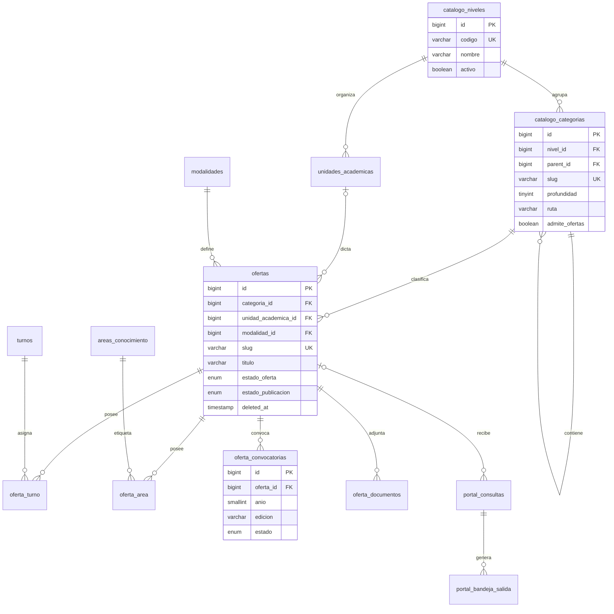

# Diagrama entidad-relación del catálogo

```mermaid
erDiagram
    catalogo_niveles ||--o{ catalogo_categorias : agrupa
    catalogo_niveles ||--o{ unidades_academicas : organiza
    catalogo_categorias ||--o{ catalogo_categorias : contiene
    catalogo_categorias ||--o{ ofertas : clasifica
    unidades_academicas o|--o{ ofertas : dicta
    modalidades ||--o{ ofertas : define
    ofertas ||--o{ oferta_turno : posee
    turnos ||--o{ oferta_turno : asigna
    ofertas ||--o{ oferta_area : posee
    areas_conocimiento ||--o{ oferta_area : etiqueta
    ofertas ||--o{ oferta_convocatorias : convoca
    ofertas ||--o{ oferta_documentos : adjunta
    ofertas o|--o{ portal_consultas : recibe
    portal_consultas ||--o{ portal_bandeja_salida : genera

    catalogo_niveles {
        bigint id PK
        varchar codigo UK
        varchar nombre
        boolean activo
    }
    catalogo_categorias {
        bigint id PK
        bigint nivel_id FK
        bigint parent_id FK
        varchar slug UK
        tinyint profundidad
        varchar ruta
        boolean admite_ofertas
    }
    ofertas {
        bigint id PK
        bigint categoria_id FK
        bigint unidad_academica_id FK
        bigint modalidad_id FK
        varchar slug UK
        varchar titulo
        enum estado_oferta
        enum estado_publicacion
        timestamp deleted_at
    }
    oferta_convocatorias {
        bigint id PK
        bigint oferta_id FK
        smallint anio
        varchar edicion
        enum estado
    }
```
